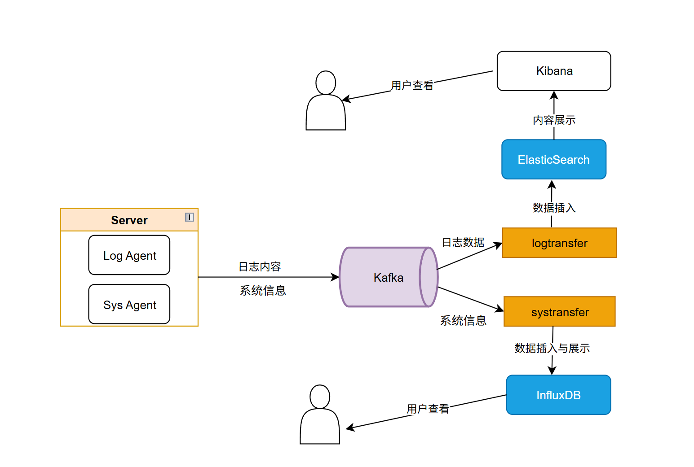

# 注意事项：
- 如果你的服务器的 xxx.log 文件内容不是标准 JSON 格式，你需要将内容转换为标准 JSON 格式，可以使用Python 脚本等转换，这里不再赘述
- `etcd demo\put get` 可以用来临时将服务器的日志配置项插入etcd进行测试
- `test`可以用来临时获取本机的外网ip地址
# 项目总览:

# 更新：日志文件内容中没有服务器 IP 字段，如何在 Elasticsearch 中按服务器 IP 分区存储日志内容？并且在每个IP下还能按日志文件名进行划分，最终在kibana展示

在tailfile.go中对tailtask追踪的每一行日志内容进行添加IP和path字段封装成logMsg并将JSON格式序列化为[]byte，使用`sarama.ProducerMessage`封装成标准的kafka消息格式，发送到kafka
```go
logMsg := LogMessage{
			IP:       common.GetOutboundIP(), // 获取本机IP地址
			Path:     tt.path,
			LineText: line.Text,
		}
jsonBytes, err := json.Marshal(logMsg)
msg := &sarama.ProducerMessage{ // 创建一个新的消息
			Topic: tt.topic,                      // 设置主题
			Value: sarama.ByteEncoder(jsonBytes), // 设置消息内容
		}
kafka.SendMsgChan(msg)  
```

**最终可以在kibana中通过过滤器筛选实现以下展示结构**：
```
Server：IP2
├── /var/log/syslog
│ ├── [2025-06-06 10:00:01] systemd[1]: Started Session 123 of user root.
│ ├── ......
├── /var/log/nginx/access.log
│ ├──  192.168.1.101 - - [06/Jun/2025:10:01:00 +0000] "GET /index.html HTTP/1.1" 200 1024
│ ├── ......
└── ...
Server：IP2
├── /var/log/syslog
│ ├── [2025-06-06 10:00:01] systemd[1]: Started Session 123 of user root.
│ ├── ......
├── /var/log/nginx/access.log
│ ├──  192.168.1.101 - - [06/Jun/2025:10:01:00 +0000] "GET /index.html HTTP/1.1" 200 1024
│ ├── ......
└── ...
```
# 日志聚合完整流程
## 初始化
### 用户：
- 部署loganget到对应服务器
- 向etcd中对应该服务器的ip关键字中添加日志配置信息（路径，主题）
- 保证日志文件内容是标准JSON格式
### 程序：
#### Logagent：
- **将ini配置文件内容映射到配置结构体**
- **初始化etcd连接**：创建etcd客户端，创建Watch监听etcd中对应ip关键字的配置项内容变化并发送到tailfile
- **初始化tailfile**：根据etcd中的日志配置项创建tailTask追踪日志内容并添加IP和path字段进行封装成标准kafka消息格式发送到kafka，创建通道接收etcd配置项变化的消息(来自etcd)，创建Watch监听通道消息并更新tailTask
- **初始化kafka生产者**：创建生产者实例，创建通道接收日志内容消息(来自tailfile)，创建协程监听通道中的日志消息并发到kafka
#### Logtransfer：
- 初始化es连接:创建es客户端，创建es消息通道接收kafka消息（来自kafka消费者）
- 初始化kafka消费者：创建消费者实例订阅目标主题，创建匿名协程从kafka从消费消息并将消息发送到es消息通道
#### Sysagent和systransfer
`与Log的类似`,但不需要`tailfile`进行追踪和`etcd`，直接通过`gopsutil`库获取系统信息并存储到结构体中，将存储在结构体中的消息内容封装成kafka的消息格式直接发送到kafka，`systransfer`获取kafka中的系统信息消息插入到时序数据库`InfluxDB`中，InfluxDB集成了展示功能，也可以额外添加Granfana进行展示。
不再过多赘述
## 执行流程：
### 当某日志文件有新内容
 → Tailtask追踪日志内容并将添加IP和path字段封装成kafka标准消息格式发送到kafka生产者的消息通道
 → kafka生产者将消息根据配置项内容发送到kafka对应主题
 → kafka消费者从kafka对应主题中消费到新消息并发送到es的消息通道 
 → es接收到日志消息并进行封装添加到对应索引→kibana从es中获取数据实时展示
 
### 当etcd的日志配置项被用户修改更新时
→ etcd Watch监听到修改的内容并将消息发送到tailfile的消息通道
→ tailfile从消息通道收到修改消息并根据内容更新对应的tailTask追踪实例


# Logagent:
## 作用:
从服务器指定位置收集日志内容，将每个日志文件中的内容聚合并将内容打包发送到 Kafka等待Logtransfer消费

## ⭐以下按照main.go顺序解析

## config.ini配置文件内容映射：
将配置信息保存在`config.ini`中，定义配置内容结构体`Config`、`KafkaConfig`、`EtcdConfig`，使用`go ini`包的`MapTo`函数将`config.ini`中的内容映射至结构体储存。

## common.go 定义存储日志收集配置项的结构体，定义获取本机IP的函数
`type CollectEntry struct` 定义了**日志文件路径**以及**日志文件存储在kafka的主题**
**从etcd中获取的键值通过Json.Unmarshal反序列化并存储在CollectEntry中**

`GetOutboundIP()`获取本机外网IP，用于替代`config.ini`里面的etcd关键字占位符


## `kafka.Init`初始化kafka连接
传入结构体中的字段内容进行初始化
### `kafka.go`解析
#### `kafka.Init`:创建生产者实例
定义全局 `client`和`msgchan`，分别表示`生产者实例`和`消息发送通道`
`sarama.NewConfig()`创建生产者配置项
`sarama.NewSyncProducer`传入kafka地址和生产者配置项，生成生产者实例
`make(chan *sarama.ProducerMessage, chansize)`创建一个传输sarama.ProducerMessage类型数据(kafka的消息类型)的消息发送通道
`go SendMsg() ` 启动一个协程持续监听msgchan通道中的消息，读取消息并发送到Kafka

#### func SendMsg()
负责从消息通道中读取消息并调用生产者实例实例的SendMessage方法：`client.SendMessage(msg)`发送消息到 Kafka
#### func SendMsgChan(msg *sarama.ProducerMessage)
由于`msgchan`不对外暴露，所以定义此函数供`tailfile.go`调用将日志文件内容发送到该通道

## -`etcd.Init()`初始化etcd连接
传入结构体中的字段内容进行初始化
### `etcd.go`解析
#### `etcd.Init()`创建全局etcd客户端
`client *clientv3.Client `- 一个全局的 etcd 客户端变量,通过`clientv3.New()`初始化

#### `func GetConf()` 从etcd拉取日志收集配置项
通过`client.Get`按照关键字从中获取日志配置项键值(日志文件路径和主题)并通过`json.Unmarshal`反序列化到`CollectEntry`结构体中储存。

#### `func WatchConf()`  监听 etcd 中的日志收集配置项变化
**for循环持续监听**
如果etcd中的日志收集配置项发生任何增删改时调用`tailfile.SendNewConf`通知`Tail`根据更改内容来更新`tailTask 日志文件追踪实例`

## 从etcd中拉取需要收集的日志配置项
`fmt.Sprintf`使用本机 IP地址替换collect_key 中的占位符
`etcd.GetConf`传入日志收集配置项的键进行拉取配置项内容
`go etcd.WatchConf`创建一个协程去监听 etcd 中的日志收集配置项变化

## `tailfile.Init`对拉取到的日志配置项中的每个日志文件进行追踪
`tailfile.Init(allConf)` // 传入日志文件路径
`allConf`是`etcd.GetConf`拉取到的日志配置项，以切片形式保存若干日志文件的路径和主题

### `tail.manager.go`解析
`tailTaskManager`结构体：用于管理所有的tailTask追踪实例，包含
- `存储若干tailTask 实例的映射切片tailTaskMap` 
- `存储若干日志收集配置项的列表collectEntryList`
- `用于从etcd接收日志配置项的通道confChan  `
#### `tailfile.Init`
初始化一个`tailTaskManager`的实例对象
依次遍历传入的日志配置项切片，对每个日志配置项使用`go tt.Run() `启动一个  tailTask 实例，开始持续追踪日志文件内容

最后单独`go ttMgr.WatchConf()`启动一个 goroutine 来监听日志配置项的通道`confChan`的消息（由etcd.WatchConf发送）当etcd中日志配置项发生更改删除时Tail能够及时接收并对tailTask 实例进行更新。

#### `func (ttMgr *tailTaskManager) WatchConf()`方法
监听日志配置项的通道`confChan`的消息（由etcd.WatchConf发送）
- 1.如果添加了新日志配置项：`tailTaskManager`中不存在则为新的日志收集配置项使用`newTailTask`创建新的` tailTask 实例`，如果已经存在的日志收集配置项保持不变
- 2.如果删除了旧的日志配置项：从 `tailTaskManager`的`tailTaskMap`中删除对应的 `tailTask 实例`，并停止`tail.TailFile`创建的文件追踪实例以及关闭对应的`go协程`

#### `func (ttMgr *tailTaskManager) isExist()`方法
检查`tailTaskManager`的`tailTaskMap`中是否存在指定的日志收集配置项

#### `func SendNewConf`
供etcd.go中调用 将更新了配置项的消息发送到confChan通道
### `tailfile.go`解析
结构体`tailTask` 存储了一个tailTask 实例的信息,包括`日志文件路径`,`日志主题`,`tail.Tail 的实例(tailTask 追踪实例本身)`

#### `func (tt *tailTask) Run()` 方法-启动 tailTask 实例
`启动tailTask实例`：追踪读一个日志文件内容的新行，将每一行内容添加IP和Path字段进行封装，使用`sarama.ProducerMessage`封装成kafka的消息格式通过`kafka.SendMsgChan`发送到kafka的消息通道中随后被发送到kafka

#### `func newTailTask()` 新建一个tailTask实例
`tail.Config`定义实例的配置信息

定义`tailTask`结构体的内容

tail.TailFile创建`tailTask`结构体中真正的`tail.Tail `文件追踪实例


# Logtransfer:
## 作用:从kafka中消费日志消息写入到elasticsearch中并通过Kibana进行展示
## 消息处理过程:
从kafka拿到`msg.value`,反序列化到结构体`m1`保存，使用`es.PutLogData`把m1发送到通道`logDataCha`让协程异步读取消息并重新序列化为[]byte,将[]byte消息转换为Io.Reader类型，使用`esClient.client.Index`将最终插入到ES对应索引中

`msg.value` → `json.Unmarshal(msg.Value, &m1)` → `es.PutLogData(m1)` → `esClient.logDataChan <- m1 ` → `for msg := range esClient.logDataChan {b, err := json.Marshal(msg)}` → `esClient.client.Index(index, bytes.NewReader(b))`

**之所以反序列化Unmarshal又序列化Marshal有以下原因**:
-  1. ⭐验证 Kafka 消息是否为合法 JSON格式：Kafka 消息是原始[]byte，[]byte中不一定是标准的 JSON 格式，非JSON格式经过json.Unmarshal会报错，过滤了非JSON格式的日志数据
-  2. 支持对日志结构进行加工或增强

## ⭐以下按照main.go顺序解析

## logtransfer.ini配置文件内容映射
将配置信息保存在`logtransfer.ini`中，`model.go`定义了一系列结构体用于存储等待被调用的配置信息
使用`go ini`包的`MapTo`函数将`logtransfer.ini`中的内容映射`model.go`中定义的结构体储存。

## es.Init 初始化elasticsearch

### `es.go`解析

全局结构体 `ESClient` 存储es客户端，接收kafka消费消息的通道，es的索引名称
#### `func Init`
`esClient.client, err = elastic.NewClient()`初始化一个es客户端
`esClient.logDataChan =make(chan interface{}, maxSize)`初始化一个es消息通道 接收kafka消费消息(由kafka.go的消费者实例发送)
`esClient.index = index `添加一个es的索引

`go sendToES(index)`：启动多个协程从消息通道取kafka消息异步的插入到es

#### ` func sendToES()`
senToES 函数用于将通道中的日志数据写入到 Elasticsearch，没有消息则阻塞等待

#### `func PutLogData()`
供外部`kafka.go`的消费者实例调用将从kafka中消费的消息发送到es通道`logDataChan`

## kafka.Init 初始化kafka的消费者实例
 ### `kafkas.go`解析
 #### `func Init`
` sarama.NewConsumer`:创建消费者
`consumer.Partitions`：获取kafka的相应主题的所有分区

##### `for partition := range partitionList`遍历所有分区
 `pc = consumer.ConsumePartition`：对每个分区进行订阅
###### `go func(pc sarama.PartitionConsumer)`:创建匿名协程异步从每个分区消费消息
`for msg := range pc.Messages()`：遍历所有订阅分区的实例
`err = json.Unmarshal(msg.Value, &m1) `：将消息内容解析并存储到 m1中
`es.PutLogData(m1)`：将解析后的消息发送到es的消息通道等待es后续处理

# Sysagent和Systransfer 高度相似不再赘述(collect.info)